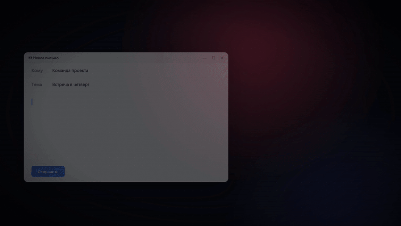

# Voices

Голосовая диктовка в любое окно Windows. Нажмите `Ctrl+Shift+Space`, скажите текст и нажмите сочетание ещё раз: ИИ распознает речь, уберёт слова-паразиты, расставит знаки и вставит текст туда, где стоит курсор. Русский и английский можно смешивать.

▶ [Промо-ролик целиком](https://github.com/Nikita-Ardashev/voices-releases/raw/main/media/voices-promo.mp4) — MP4, 32 секунды, 9,6 МБ, со звуком

## Скачать

- **[⬇ Установщик для Windows (x64)](https://github.com/Nikita-Ardashev/voices-releases/releases/latest/download/win-x64-Voices-Setup.zip)** — обновляется сам.
- **[⬇ Портативная версия](https://github.com/Nikita-Ardashev/voices-releases/releases/latest/download/win-x64-Voices-Portable.zip)** — без установки, можно запускать с флешки.

Все версии и список изменений — на странице [Releases](https://github.com/Nikita-Ardashev/voices-releases/releases).

## Возможности

- **Диктовка в любое приложение.** Почта, мессенджеры, документы, редактор кода — текст вставляется туда, где стоит курсор.
- **Режимы обработки.** «Почистить», «Дословно», «Деловое письмо», «Перевести на EN», «Код» или свой промпт. Режим можно сменить прямо во время записи.
- **Правка выделенного голосом.** Выделите текст или код и скажите, что с ним сделать: «переведи на английский», «переименуй переменную в total», «добавь обработку ошибок». Ответ ИИ заменит выделение.
- **Быстрые заметки.** `Ctrl+Shift+Alt+Space` сохраняет мысль в заметки вместе с аудио. Заметку можно структурировать, сократить или выделить из неё задачи через ИИ, а любую прошлую версию — восстановить.
- **Запись с удержанием.** Держите `Ctrl+Alt+Enter`, пока говорите, — отпустили, и текст на месте.
- **История.** Последние записи можно прослушать и обработать ещё раз, например другим режимом. Если распознать не удалось, запись не теряется.
- **Свои сочетания клавиш**, в том числе из одних модификаторов, например `Ctrl+Win`.

## ИИ-провайдер

Voices распознаёт речь через ИИ, и для работы нужен ключ одного провайдера на выбор:

| Провайдер | Цена | Нужен VPN из России |
|---|---|---|
| Google Gemini | Бесплатно с лимитами, лучшее качество | Да |
| Groq | Бесплатно с лимитами, очень быстро | Да |
| OpenRouter | Платно, доли цента за минуту | Нет |
| Cloudflare Workers AI | Бесплатная дневная квота | Нет |
| Свой сервер (Ollama, LM Studio и др.) | Бесплатно, работает локально | Нет |

Как получить ключ, подсказывает сам Voices: под полем ключа есть пошаговая инструкция для выбранного провайдера. Ключ хранится только на вашем компьютере. Если провайдер недоступен в вашем регионе, адрес VPN можно указать в **Настройки → Прокси**.

## Установка

1. Скачайте `win-x64-Voices-Setup.zip` и распакуйте его в любую папку. Установщик из архива напрямую не запускайте: рядом с ним лежит скрытая папка `.installer`, без которой он не работает.
2. Запустите `Voices-Setup.exe`. Если появится «Windows защитила ваш компьютер», нажмите **Подробнее → Выполнить в любом случае**: установщик пока не подписан.
3. После установки откроется мастер настройки: ИИ-провайдер и ключ, микрофон, горячая клавиша, режим, автозапуск.

**Портативная версия.** Распакуйте `win-x64-Voices-Portable.zip` в любую папку, куда у вас есть права на запись (например, «Документы», но не Program Files), и запустите `Voices.cmd`. Настройки, ключи, история и заметки хранятся в папке `data` рядом с программой — её можно переносить целиком.

## Что нужно

- Windows 10 или 11, 64-бит
- Microsoft Edge WebView2 Runtime (в Windows 11 уже есть)
- Микрофон и доступ к интернету (для своего локального сервера интернет не нужен)

## Обновления

Установленная Voices обновляется сама: новая версия скачивается в фоне, а приложение предлагает перезапуститься. После обновления окно «Что нового» покажет, что изменилось.

Портативная версия сама не обновляется: когда выйдет новая, Voices покажет карточку «Вышла версия …». Закройте Voices и распакуйте новый архив в ту же папку с заменой файлов — папка `data` сохранится.

## Поддержать автора

Voices бесплатный и без рекламы. Если он экономит вам время, можно [поддержать автора на CloudTips](https://pay.cloudtips.ru/p/a210b36b) — ссылка есть и в самом приложении, внизу боковой панели и в меню трея.

## Удаление

**Параметры → Приложения → Установленные приложения → Voices → Удалить.** Перед удалением выключите автозапуск в настройках Voices.

Портативную версию удалить просто: выключите автозапуск в настройках, закройте Voices и удалите папку.

---

В этом репозитории лежат только установщики, файлы обновлений и промо-материалы.
